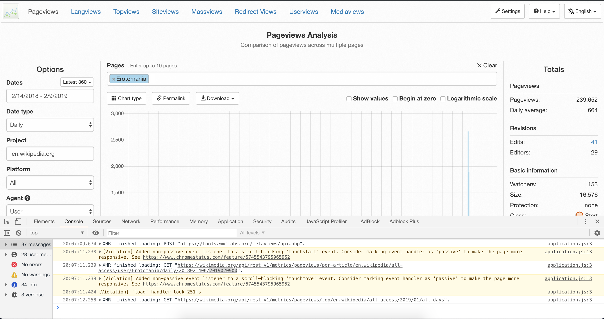

```{r setup, include=FALSE}
knitr::opts_chunk$set(echo = T)
```

#Goal 

In this lecture we will explor a variety of data sources. I'll do my best to include some data sources that are of interest to all subjects and cover methods to extract data from websites. However, given my background we will first introduce a variety of data sources that may be of use to economists. 


#Economic Data Sources

The package \emph{quantmod} in R "is designed to assist the quantitative trader in the development, testing, and deployment of statistically based trading models." To use a package in R (and Python) you have to first install the package. After the package is installed you have to load the package in to every new R (Python) session. That is, if you close R (Python) you have to reload in the package in order to use the functions within the package. 

In R we can install packages through the command \emph{install.packages('name of package')}. For example, below we will install the package quantmod:

```{r}
#Delete the hashtag/pound symbol below to install the pacakge on your machine
install.packages('quantmod')
```

Again, the installation only needs to happen once. From here on out to use the package you can simply load it in throught the command \emph{library(package name)}, notice that no quotations are needed. 

```{r}
library(quantmod)
?quantmod
```

In the package documentation we can see there are many built in functions tailored for applications in quantitative finance. Given that this lecture is focused on gathering data we will give particular attention to the function \emph{getSymbols()}.

```{r}
?getSymbols
```

The getSymbols function in the quantmod package can pull data from the following sources: Yahoo Finance, Google Finance (discontinued), MySQL, FRED, csv, RData, oanda (a foreign exchange broker), and av (alpha vantage).

## Federal Reserve Economic Data (FRED)

For conducting research in Macroeconomics, data from FRED is extremely useful. We can pull up-to-date data on unemployment, inflation, GDP growth, etc. FRED has excellent coverage of data for the United States and other developed economies but is lacking in data for developing/emerging markets.

For example, we can pull data on Real GDP growth for the United States quite easily. The data the FED has on record can be found here: https://fred.stlouisfed.org/series/A191RL1Q225SBEA


On every page of the FRED website there are symbols for economic variables. These symbols can be used in conjunction with the quantmod function \emph{getSymbols} to pull data directly into R. The default option for the \emph{getSymbols} function is to pull data from Yahoo! Finance, we can tell the \emph{getSymbols} function that we are interested in collecting data from FRED through the option \emph{src}.

```{r}
?getSymbols
getSymbols('A191RL1Q225SBEA',src = 'FRED')
plot(A191RL1Q225SBEA,ylab='%',xlab='',main='Real GDP Growth USA')
```

Every time we run the command \emph{getSymbols('A191RL1Q225SBEA',src = 'FRED')} R will get the most recent data that is published by the Federal Reserve. Notice that although we used the base plot command we got a nicely formatted plot that contains dates along the x-axis. If you pay careful attention to your global enviornment, you'll see that the data downloaded by quantmod is actually coded as a time-series object (xts). Time-series objects contain dates and a series of data.

In the example above, we passed the \emph{getSymbols} function a string containing they symbol for Real GDP growth. We can pull data on a variety of series at once by passing the \emph{getSymbols} a vector of symbols. Below we will pull data on inflation (as measured by CPI), unemployment, the National Bureau of Economic Research (NBER) recession indicator, and the ten year treasury rate (the cost of borrowing for the US Government for 10 years):

```{r}
#Consumer Price Index for All Urban Consumers: All Items (CPIAUCSL)
#Civilian Unemployment Rate (UNRATE)
# NBER based Recession Indicators for the United States from the Period following the Peak through the Trough (USREC)
#10-Year Treasury Constant Maturity Rate (DGS10)
getSymbols(c('CPIAUCSL','UNRATE','USREC','DGS10'),src = 'FRED')
#The CPI data is an index; we can convert it to percentages using the command Delt
  #12 period differences are used to annualize the inflation rate, given that the data is monthly
cpi_percentage <- Delt(CPIAUCSL,k=12)*100
plot(cpi_percentage,ylab='%',xlab='',main='Inflation Rate USA')
plot(UNRATE[index(UNRATE) >= as.Date('2000-01-01')],ylab='%',xlab='',main='Unemployment Rate USA')
plot(USREC,ylab='',xlab='',main='NBER Recession Indicator USA')
plot(DGS10,ylab='%',xlab='',main='10 Year Treasury Rate USA')
head(DGS10)
```

At this point we should have six objects in our global envionment, all of which are 'xts' objects. We can combine all of our data into one data.frame through the command \emph{merge}. R will recognize that time-series objects should be merged together by dates automatically.

```{r}
#Convert the daily interst rates into quarterly data
quarterly_interest <- to.quarterly(DGS10)
head(quarterly_interest) #OHLC data (open high low close of the quarter).
economic_data <- merge(A191RL1Q225SBEA,cpi_percentage,UNRATE,USREC,quarterly_interest[,4],all=F)
#We can change the column names:
colnames(economic_data) <- c('realGdp','cpi','unrate','recession','tenYearRate')
head(economic_data)
tail(economic_data)
```

Given the structure of our data we can now easily run a vareity of calculations, such as trying to build a model to forecast GDP, Unemployment, or simply see how different economic variables behave during expansionary versus recessionary times. 
The NBER Recession indicator takes on a value of 1 during recession and a value of 0 during expansionary periods.

```{r}
#Tapply applies to calculations to a set of ids; here will summarize the data in the first argument, into two groups 0 (expansion) and 1 (recession).
tapply(economic_data$realGdp,
       economic_data$recession,function(x){
         max(x)
       })
tapply(economic_data$cpi,economic_data$recession,summary)
tapply(economic_data$unrate,economic_data$recession,summary)
tapply(economic_data$tenYearRate,economic_data$recession,mean)
```


## Yahoo Finance

The ability to pull data from Yahoo! Finance makes it easy to prototype ideas in financial research or to build portfolio managment software for your own financial endeavors. One can pull data form Yahoo! Finance by again extracting the symbols on the Yahoo! Finance website and passing them through the getSymbols function.


```{r}
getSymbols('^GSPC',from ='1950-01-01')
plot(GSPC,main='S&P 500\n (largest 500 companies by market capitalization)')
```


## Alpha Vantage

Alpha Vantage is a new data aggregation company that provides free access to intra-day stock market data, foreign exchange data, and cryptocurency data. They are free to use but have a rate limit of up to 5 API requests per minute and 500 requests per day. They offer a paid service for higher frequency data requests.

All of there documentation can be found here: https://www.alphavantage.co/documentation/

```{r}
#getSymbols(c('INTC','ORCL'), src = 'av', api.key = '[your key]') 
```

## World Bank

The World Bank was formed in 1944 to help provide funding for poor/developing countries that were unable to recieve funding from commercial/institutional lenders. The World Bank collects data on countries from across the globe and their datasets are used for lots of reserach in development economics. Their website is:

https://databank.worldbank.org/data/home.aspx

Similar to \emph{quantmod}, there is a package in R called \emph{wbstats} that access the online API (application programming interface) the World Bank has created. 

```{r}
#install.packages('wbstats')
library(wbstats)
```

The \emph{wbstats} library contains a helpful search feature to find the symbols the World Bank uses to code up their datasets. For instance if we wanted to find data on unemployment on all countries we could use the command \emph{wbsearch} to view all of the available 

```{r}
unemp_search <- wbsearch(pattern = "unemployment")
head(unemp_search)
```

We can pick one of the available symbols and download all of the data for that symbol through the \emph{wb} command:

```{r}
#Download all unemployment data for everything in the world bank database
unemployment_data <- wb(country = 'all',indicator = "UNEMPSA_") 
head(unemployment_data)# First 6 rows of data
tail(unemployment_data)# Last 6 rows of data
```

Note that the data structure stacks each countries data on top of each other. You have to be careful with such data when calculating things like returns or changes.

See here for more: https://cran.r-project.org/web/packages/wbstats/vignettes/Using_the_wbstats_package.html

## International Monetary Fund

The IMF was created alongside the World Bank in 1944 at the Bretton Woods Conference. "The International Monetary Fund (IMF) is an organization of 189 countries, working to foster global monetary cooperation, secure financial stability, facilitate international trade, promote high employment and sustainable economic growth, and reduce poverty around the world." The IMF has also has a publicly accessible dataset that can be loaded into R:

```{r}
#install.packages('imfr')
library(imfr)
```

Each R package has a vignette that summarizes all of the features of the pacakge

Check out this pacakges documentation at: https://cran.r-project.org/web/packages/imfr/imfr.pdf

Examples use: https://cran.r-project.org/web/packages/imfr/README.html

## Quandl

Quandl is a large data aggregator that collects data from publicly accessible sources (eg. FRED) as well as contains private \emph{alternative} data that is available for purchase (https://www.quandl.com/). To use their R package (also have a python package) you need to create a free API key.

See here for more information: https://www.quandl.com/tools/r

```{r}
#install.packages('Quandl')
library(Quandl)
Quandl.api_key("1zm1xSnnoqFeAGksg3S1")
oil_prices = Quandl("OPEC/ORB")
plot(oil_prices$Date,oil_prices$Value,typ='l',xlab='',ylab='$',main='OPEC Reference Basket')
grid()
```


#Generic Web Scraping

## IEX exchange (A simple API)

The investors exchange was founded in 2012 to ban the use of high frequency trading. As they are new exchange they have been providing a variety of resources for free to entice investors to trade more on their exchange. 

https://iextrading.com/developer/docs/

They have a web api that we can use to load data into R. For instance at the following URL the IEX exchange has the most recent trading day of data for Apple stock sumarized in one-minute quotations:

https://api.iextrading.com/1.0/stock/aapl/chart/date/20190529 

This data is known as JSON (JavaScript Object Notation). In essence the data is formatted as combinations of keys and values for a given time stamp. We can load this type of data directly with the help of the \emph{jsonlite} package into R as follows:

```{r}
url <- 'https://api.iextrading.com/1.0/stock/aapl/chart/date/20190529'
#install.packages('jsonlite')
library(jsonlite)
data <- fromJSON(url)
head(data)
```

## Collect data from Wikipedia tables and lists

Occasionally it is quite helpful to pull data that are in structured tables on websites. An example that I'm sure cuts across a wide variety of disciplines are the awesome tables on Wikipedia pages. For example, suppose I want to pull stock data on all of the companies that are in the S\&P 500. First I would need to know all of the 500 companies in the S\&P 500 (duh). Fortunately, on this Wikipedia page there are listed the most recent companies in the S\&P 500 (they change over time): https://en.wikipedia.org/wiki/List_of_S%26P_500_companies

First we need to get the HTML from the wikipedia page through the command \emph{GET} in the \emph{httr} package, then we can load in tables on \emph{most} websites through the command \emph{readHTMLTables} that comes in the \emph{XML} package. We need the httr package to pull data from all URLs that have an HTTPS address. 

```{r}
#install.packages(c('XML','httr'))
library(XML)
library(httr)
url <- 'https://en.wikipedia.org/wiki/List_of_S%26P_500_companies'
?GET
html_data <- GET(url)
html_data$content
html_data$status_code
html_data$status_code
html_data$url
html_text <- content(html_data,as = 'text')
wiki_tables <- readHTMLTable(html_text)
#Got it!

wiki_tables[[2]]

head(wiki_tables[1])
#Now we can do some formatting specifically to this example#
sp_companies <- wiki_tables[[1]]

sp_companies$V2
sp_companies <- apply(sp_companies,2,as.character)
head(sp_companies)
colnames(sp_companies) <- as.character(sp_companies[1,]) #Set colnames to first row
sp_companies <- data.frame(sp_companies,stringsAsFactors = F)
sp_companies <- sp_companies[-1,] #Remove the first row
head(sp_companies)
```

How might we turn the above code into a function that we can pass in a url and extract all of the html tables on the page?

```{r}
#Make a function to get all html tables
df <- read.csv('~/Desktop/C2ImportCalEventSample.csv')
head(df)

```


Now lets take a look at extracting lists from Wikipedia pages, to keep our Psych friends happy lets pull data on Mental Disorders:

https://en.wikipedia.org/wiki/List_of_mental_disorders

Similar to the command \emph{readHTMLTables} there is a command called \emph{readHTMLList} in the \emph{XML} package that we can use to collect lists:

```{r}
url <- 'https://en.wikipedia.org/wiki/List_of_mental_disorders'
html_data <- GET(url) #httr
html_text <- content(html_data,as = 'text')#httr
wiki_lists <- readHTMLList(html_text) #XML
length(wiki_lists)
#wiki_lists
#wiki_lists[[21]]
main_disorders <- unlist(wiki_lists[2:20])
```

## Collect Wikipedia Page Views

An excellent tool by Wikipedia provides data on how frequently individuals view a particular wikipedia page:

https://en.wikipedia.org/wiki/Wikipedia:Pageview_statistics#Pageviews_Analysis

https://tools.wmflabs.org/pageviews/?project=en.wikipedia.org&platform=all-access&agent=user&range=latest-20&pages=Cat|Dog

We have collected quite a long list of 190 mental disorders listed on Wikipedia. We can use the Wikipedia page views tool along with our list of disorders to see how frequently individuals look up specific disorders in the past two years.

For example, the accute stress disorder page has recieved 460 page views:


In most web browsers you have \emph{Development tools}. Usually these tools can be accessed by right clicking on a web page and selecting 'Inspect' or 'Inspect Element'. Once the developer tools are open click on 'Console'. This will show you all JavaScript requests that the website is making. Your console should look like the following:




```{r}
#install.packages('rvest')
library(rvest)
#From the developer console:
  #https://wikimedia.org/api/rest_v1/metrics/pageviews/per-article/en.wikipedia/all-access/user/Erotomania/daily/2018021400/2019020900
all_urls <- paste('https://wikimedia.org/api/rest_v1/metrics/pageviews/per-article/en.wikipedia/all-access/user/',main_disorders,'/daily/2010010100/2019020900',sep='')
head(all_urls)
all_urls <- gsub(' ','_',all_urls)
head(all_urls)
data <- fromJSON(all_urls[1])
data <- data$items
head(data)
```

Notice the timestamps column is recorded as a character. We should let R know that this column is actually a date:

```{r}
#Remove the trailing zeros
substr(data$timestamp[1],1,8)
data$timestamp <- substr(data$timestamp,1,8)
data$timestamp <- as.Date(data$timestamp,'%Y%m%d')
plot(data$timestamp,data$views,typ='l',main = main_disorders[1],ylab='Page Views',xlab='')
```

How might we want to extract the data for all of the urls?

```{r}
hold_all_data <- list()
# How much time do we expect the loop below to take to run?
# for(i in 1:length(all_urls)){
#   tryCatch({
#     data <- fromJSON(all_urls[i])
#     data <- data$items
#     data$timestamp <- substr(data$timestamp,1,8)
#     data$timestamp <- as.Date(data$timestamp,'%Y%m%d')
#     hold_all_data[[i]] <- data
#     names(hold_all_data)[i] <- main_disorders[i]
#     Sys.sleep(runif(1,1,8))
#     print(i/length(all_urls))
#   },error = function(e) print(e))
# }
# saveRDS(hold_all_data,'all_disorder_wiki_page_views.RDS')
hold_all_data <- readRDS('all_disorder_wiki_page_views.RDS')
length(hold_all_data)
head(hold_all_data[[1]])
head(hold_all_data[[189]])
all_disorder_views <- do.call('rbind',hold_all_data)


summary_stats <- tapply(all_disorder_views$views,all_disorder_views$article,summary)


summary_stats <- do.call('rbind',summary_stats)
head(summary_stats)
summary_stats <- summary_stats[order(summary_stats[,3],decreasing = T),]
head(summary_stats,10)
write.csv(summary_stats,'wikipedia_page_views_summary_statistics.csv')

plot(hold_all_data$`Alcohol abuse`$timestamp,
     hold_all_data$`Alcohol abuse`$views,typ = 'l',
     xlab='',ylab='Views', main = 'Alcohol abuse')

plot(hold_all_data$`Antisocial personality disorder`$timestamp,
     hold_all_data$`Antisocial personality disorder`$views,typ = 'l',
     xlab='',ylab='Views', main = 'Antisocial personality disorder')
```


```{r}
library(rvest)
url <- 'https://finance.yahoo.com/quote/INTC?p=INTC'
amazon_page <- read_html(url)
price_data <- amazon_page %>%
  html_nodes('span')%>%
  html_text()


```


